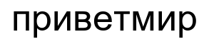
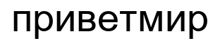
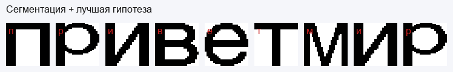
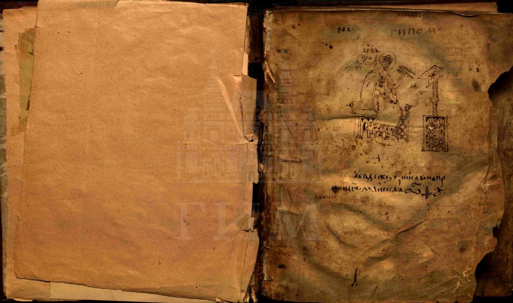
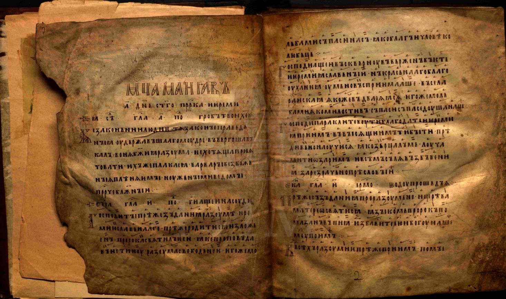
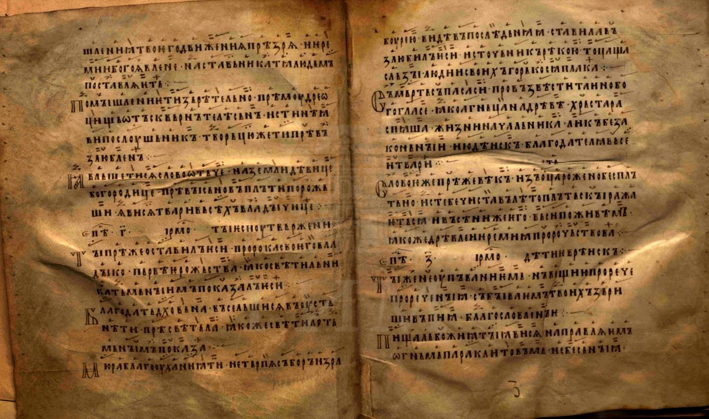

# Лабораторная работа №7 (вариант 14)
## Классификация на основе признаков, анализ профилей

В работе реализована классификация (распознавание) символов по **нормализованным признакам** и  сравнение **профилей**.

---

## Метод

### 1) Нормализованные признаки (feature vector)

Для каждого бинарного изображения символа в его bounding-box размера `w × h` вычисляются:

- **Масса** (доля закрашенных пикселей):
  - `m = sum(fg) / (w*h)`
- **Центр тяжести** (нормирован в [0..1]):
  - `cx = mean(x) / (w-1)`
  - `cy = mean(y) / (h-1)`
- **Осевые моменты инерции** относительно центра тяжести (нормированы по размеру bbox):
  - `Ixx = sum((y - ȳ)^2) / (mass * (h-1)^2)`
  - `Iyy = sum((x - x̄)^2) / (mass * (w-1)^2)`

Итоговый вектор:
```
f = [m, cx, cy, Ixx, Iyy]
```

### 2) Мера близости

Евклидово расстояние:
```
d(f, g) = sqrt( Σ (fi - gi)^2 )
```

Переход к мере близости (важное свойство: `d=0 → sim=1`):
```
sim = 1 / (1 + d)
```

### 3) Профили (опционально, “магистр”)

Строятся вертикальный и горизонтальный проекционные профили (нормированы в [0..1]), затем квантуются (например, в 10 уровней) и сравниваются **метрикой Левенштейна**. Полученная близость смешивается с признаковой:

```
sim_final = (1-α)*sim_features + α*sim_profiles
```

---

## Установка

```
python -m pip install -r requirements.txt
```

---

## Запуск

### Основной скрипт (сдача): `src/profile_classifier.py`

Скрипт сам:
- генерирует изображение строки,
- считает признаки,
- формирует гипотезы по алфавиту,
- сохраняет результаты в папку `outputs/`,
- делает эксперимент с другим размером шрифта.

#### 1) Базовый прогон (признаки + евклидово расстояние)
```
python src/profile_classifier.py --text "приветмир" --alphabet "абвгдежзийклмнопрстуфхцчшщъыьэюя" --font-size 52 --variation-font-size 56 --font-path "C:\Windows\Fonts\arial.ttf" --output-dir outputs
```

Файлы:
- `outputs/base_render.png`, `outputs/variation_render.png`
- `outputs/hypotheses.txt` (в каждой строке: гипотезы для символа, отсортированы по убыванию близости)
- `outputs/metrics.md`

#### 2) Режим профилей (п.7, Левенштейн)
```
python src/profile_classifier.py --text "приветмир" --font-size 52 --variation-font-size 56 --font-path "C:\Windows\Fonts\arial.ttf" --output-dir outputs_profiles --use-profiles --profile-weight 0.35
```

---

---

## Демонстрация (картинки + пример вывода)

**Сгенерированная строка (база):**



**Сгенерированная строка (шрифт больше на несколько пунктов):**



**Сегментация + лучшая гипотеза на каждый символ:**



**Пример файла гипотез (фрагмент):** `assets/demo_hypotheses.txt`

---

## Примеры изображений со SlavCorpora (для иллюстрации источника)

Изображения скачиваются с `https://www.slavcorpora.ru` (пример рукописи: `/manuscripts/856066a1-8663-4e31-9fbf-b740ab965c8c`).

| Пример 1 | Пример 2 | Пример 3 |
|---|---|---|
|  |  |  |

---

## Структура проекта

- `src/profile_classifier.py` — основной скрипт ЛР7 (признаки + эксперимент + опционально профили)
- `scripts/make_readme_assets.py` — скачивает примеры со SlavCorpora и генерирует картинки для README
- `lab7.py`, `feature_classifier/` — дополнительная реализация (сегментация по компонентам + CLI)
